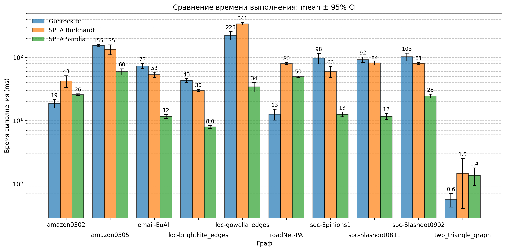
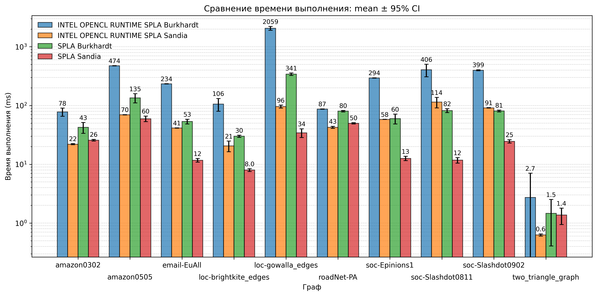

# SPLA-Gunrock Graph Analysis

## Overview
This repository implements and compares two GPU-based triangle counting algorithms:
- **SPLA** – a generalized sparse linear algebra framework for multi-GPU computations.
- **Gunrock** – a CUDA library for high-performance graph processing on GPUs.

The implementations are in C++ (with Python scripts for automation) and are built using CMake.

## Project Structure
```
├── deps/ # External dependencies (submodules)
├── src/ # C++ source files for the algorithms
├── scripts/ # Helper scripts (benchmark automation, data download, etc.)
├── results/ # Benchmark results (CSV, plots)
└── CMakeLists.txt # Build configuration
```

## Dependencies
- CMake (≥ 3.30)
- C++17 compiler (GCC, Clang)
- CUDA Toolkit (for Gunrock)
- Python 3.7+ (for scripts in `scripts/`)

## Build Options
The project uses CMake for build configuration with two main options:
- `ENABLE_GUNROCK`: Enables building and benchmarking Gunrock (default: ON)
- `ENABLE_SPLA`: Enables building and benchmarking SPLA (default: ON)

## Build & Run
```bash
git clone --recurse-submodules https://github.com/Kuarni/triangle-counting-spla-vs-gunrock.git
python3 scripts/run_all_and_analyze.py
```

### Run benchmark with specific params
```bash
python3 scripts/download.py
python3 scripts/build.py spla gunrock
bin/spla-measure [google benchmark params] --graphs [graphs paths]
bin/gunrock-measure [google benchmark params] --graphs [graphs paths]
```

## Graph Datasets

The experiments use real-world graph datasets from the Stanford Network Analysis Project (SNAP). The following graphs are included in the analysis:

| Graph Name | Description | Nodes | Edges | Type |
|------------|-------------|-------|-------|------|
| loc-brightkite_edges | Brightkite location-based social network | 58,228 | 214,078 | Social Network |
| amazon0302 | Amazon product co-purchasing network (March 02, 2003) | 262,111 | 1,234,877 | Product Network |
| roadNet-PA | Pennsylvania road network | 1,088,092 | 1,541,898 | Road Network |
| amazon0505 | Amazon product co-purchasing network (May 05, 2003) | 410,236 | 3,356,824 | Product Network |
| soc-Epinions1 | Epinions social network | 75,879 | 508,837 | Trust Network |
| email-EuAll | Email network from a European research institution | 265,214 | 420,045 | Communication Network |
| loc-gowalla_edges | Gowalla location-based social network | 196,591 | 950,327 | Social Network |
| soc-Slashdot0902 | Slashdot social network (February 2009) | 82,168 | 948,464 | Social Network |
| soc-Slashdot0811 | Slashdot social network (November 2008) | 77,360 | 905,468 | Social Network |

## Experiments

The analysis framework compares SPLA and Gunrock triangle counting graph algorithms:
- SPLA based **Burkhardt** 
- **Sandia** from SPLA (named `tc`)
- Gunrock tc

For SPLA, matrices are stored in AccCSR format for optimized performance.

## Test Environment
All benchmarks in this repository were performed on the following hardware and software configuration:

- **Processor**: AMD Ryzen 5 4600H (6 cores / 12 threads)
- **Memory**: 16 GB RAM
- **GPU**: NVIDIA RTX 2060 (6 GB VRAM)
- **Operating System**: Windows 10 22H2

## Benchmark Results on This Test Stand

Each algorithm was run 30 times to ensure statistical significance.

### Execution Time Comparison


| graph                   | triangles | Gunrock tc | SPLA Burkhardt | SPLA Sandia |
|-------------------------|-----------|------------|----------------|-------------|
| amazon0302              |    717719 |       18.7 |           42.5 |        25.8 |
| amazon0505              |   3951063 |      155.0 |          134.5 |        59.6 |
| email-EuAll             |    267313 |       73.1 |           53.4 |        11.7 |
| loc-brightkite_edges    |    494728 |       43.4 |           30.0 |         8.0 |
| loc-gowalla_edges       |   2273138 |      223.3 |          341.2 |        34.3 |
| roadNet-PA              |     67150 |       12.7 |           80.1 |        49.8 |
| soc-Epinions1           |   1624481 |       97.5 |           59.9 |        12.6 |
| soc-Slashdot0811        |    551724 |       92.4 |           82.1 |        11.7 |
| soc-Slashdot0902        |    602592 |      102.5 |           80.6 |        24.5 |
| two_triangle_graph      |         2 |        0.6 |            1.5 |         1.4 |


## Bonus SPLA GPU vs SPLA Intel OpenCL Runtime


